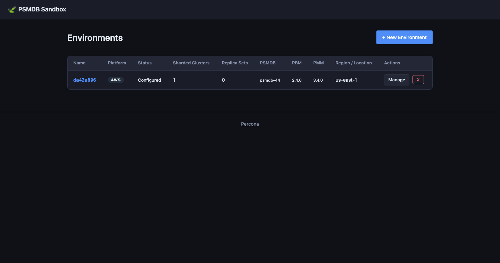
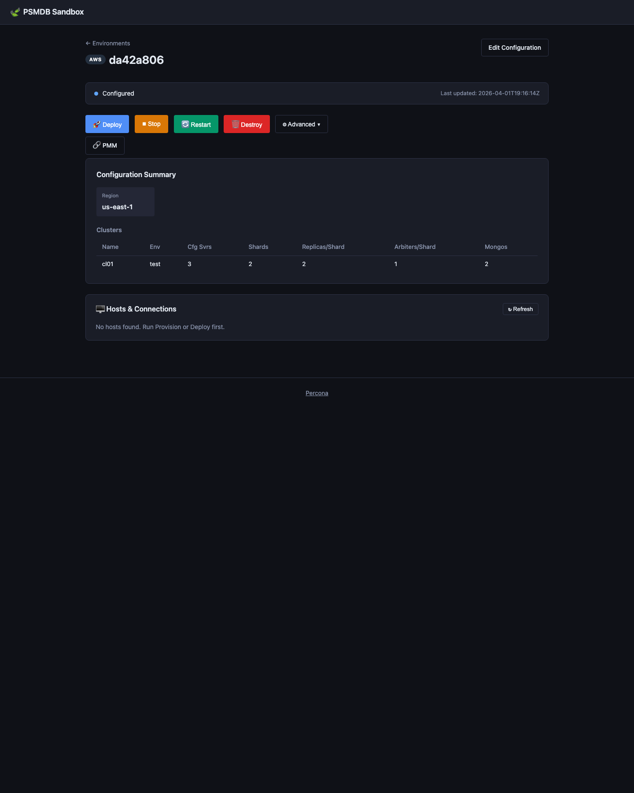
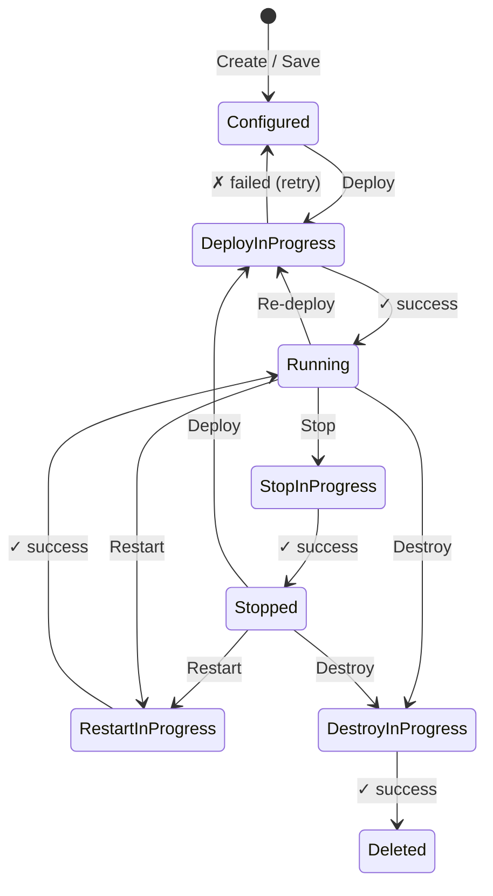
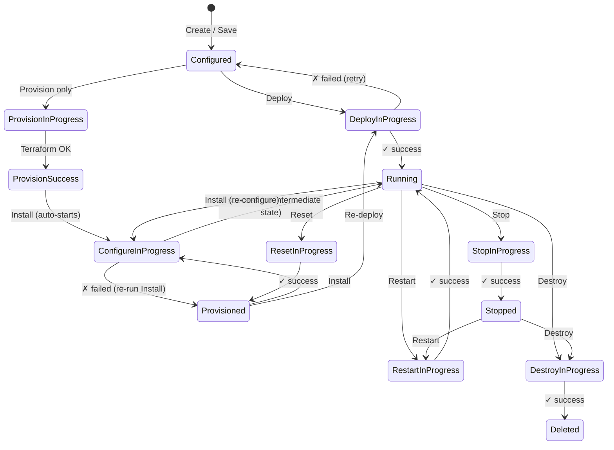

# PSMDB Sandbox

A portable, zero-dependency web frontend for **mongo_terraform_ansible** written in Go.

---

## Screenshots

### Environment list — multiple clusters at a glance



### Environment detail — current management view

The environment detail page shows the current status, primary actions,
configuration summary, service links, and automatically loads the
**Hosts & Connections** panel after infrastructure is available.



---

## State transition diagrams

### Docker



### Cloud (AWS / GCP / Azure)



> **Note:** Every `*InProgress` state may transition back to the **previous
> stable state** on failure (shown as "retry" for brevity).  There is **no**
> `ConfigureSuccess` state — a successful Ansible run goes directly to
> **Running**.

---

## Environment states

| Status                    | Platform        | Meaning                                                                                                           |
|---------------------------|-----------------|-------------------------------------------------------------------------------------------------------------------|
| **Configured**            | all             | Saved but no infrastructure exists yet.                                                                           |
| **Deploy In Progress**    | all             | Terraform (+ Ansible for cloud) running in the background.                                                        |
| **Running**               | all             | All resources up and healthy. Reached after `Deploy`, `Install`, or `Restart`.                                    |
| **Stopped**               | all             | Resources gracefully stopped (`docker stop` / Ansible stop playbook).                                             |
| **Provision In Progress** | cloud only      | Terraform provisioning infra (no Ansible yet).                                                                    |
| **Provision Success**     | cloud only      | Terraform done; Ansible `Install` step starting automatically.                                                    |
| **Provisioned**           | cloud only      | Infra exists but Ansible has not run yet. Set after `Reset` or configure failure — run `Install` to continue.     |
| **Configure In Progress** | cloud only      | Ansible playbooks running. On success → **Running** (there is no `Configure Success` state).                      |
| **Destroy In Progress**   | all             | `terraform destroy` running.                                                                                      |
| **Destroy Success**       | all             | All resources destroyed. Record kept until manually purged.                                                       |
| **Deleted**               | all             | Record removed from the UI list.                                                                                  |
| **\*\_Failed**            | all             | Any action may fail; the status becomes `<action>_failed`. Re-run the action to retry.                            |

---

## Requirements

- **Go 1.22+** (for `net/http` pattern-based routing with `{name}` params)

Optional (needed to actually run deployments):

- [Terraform](https://developer.hashicorp.com/terraform/downloads) ≥ 1.0
- [Ansible](https://docs.ansible.com/ansible/latest/installation_guide/) (for AWS / GCP / Azure deployments)
- [Docker](https://docs.docker.com/get-docker/) (for local Docker environments)
- Cloud CLI credentials configured in your environment (AWS CLI, `gcloud`, `az`, etc.)

---

## Quick Start

```bash
# From the repository root
cd ui-go
go run .
```

Or build a binary and run it from anywhere:

```bash
cd ui-go
go build -o mongodeploy .
./mongodeploy
```

Then open **http://127.0.0.1:5001** in your browser.

### Environment variables

| Variable       | Default           | Description                                                              |
|----------------|-------------------|--------------------------------------------------------------------------|
| `PORT`         | `5001`            | TCP port to listen on                                                    |
| `UI_HOST`      | `127.0.0.1`       | Bind address (use `0.0.0.0` for all interfaces)                          |
| `UI_BASE_DIR`  | current directory | Override the base directory (must contain `templates/` and `static/`)   |

---

## How it works

1. **Platform selection** – choose AWS, GCP, Azure, CHAOS or Docker.
2. **Configuration wizard** – fill in cluster topology, images/packages, credentials,
    networking, and (for cloud platforms) per-component instance types and disk sizes.
    - Image tags are fetched live from Docker Hub on startup and cached for 5 minutes.
    - Percona package release identifiers (`psmdb-80`, …) are fetched from the Percona
      repository listing on startup.
    - Each cluster and replica set includes audit plugin controls. Audit is enabled by
      default and uses the built-in write-only filter for non-system users unless you
      override it.
3. **Save** – writes `<env_id>.tfvars` inside the corresponding `../terraform/<platform>/`
   directory and records the environment in `environments.json`.
4. **Deploy** – runs `terraform init && terraform apply` (and Ansible for cloud platforms)
   in a background goroutine. Output is streamed live via Server-Sent Events.
5. **Stop / Restart** – for Docker environments, uses `docker stop` / `docker restart`
   filtered by the environment prefix; for cloud environments, runs the Ansible
   `stop.yml` / `restart.yml` playbooks.
6. **Destroy** – runs `terraform destroy`. On success the environment is automatically
   removed from the inventory and the browser redirects to the environments list.
7. **Hosts & Connections** – after a successful deploy the environment detail page shows
   every host or container with its IP address, a copy-pasteable connect command
   (`ssh user@host` or `docker exec -it <name> bash`), MongoDB connection strings for
   every replica set and cluster, and clickable **Open** buttons for PMM and MinIO
   Console URLs.  All PMM-related containers (server, Grafana renderer, Watchtower,
   and per-node PMM client sidecars) are grouped together under a single **PMM** section.

---

## File structure

```
ui-go/
├── main.go         Constants, globals, template helpers, HTTP routes, main()
├── types.go        All Go struct/type definitions and sorted-list helpers
├── state.go        Environment state persistence (load/save environments.json)
├── cache.go        In-memory TTL cache (Docker Hub tags, etc.)
├── versions.go     Docker Hub image tag fetching; Percona repo version discovery
├── tfvars.go       Terraform .tfvars file generation
├── jobs.go         Background job runner (start, stream, cancel, PID tracking)
├── regions.go      Cloud region and machine-image discovery (AWS / GCP / Azure)
├── hosts.go        Host & connection-string discovery (Docker + cloud inventory)
├── handlers.go     All HTTP handlers (environment CRUD, actions, API endpoints)
├── exec_helper.go  os/exec wrapper
├── go.mod          Go module (standard library only)
├── environments.json  Runtime state (auto-created)
├── jobs/              Background job logs (auto-created)
├── templates/
│   ├── layout.html
│   ├── index.html
│   ├── new_environment.html
│   ├── configure.html
│   └── environment.html
└── static/
    ├── style.css
    └── app.js
```

---

## Security note

This tool is intended for **local use only** (it binds to `127.0.0.1:5001` by default).
Do not expose it to the public internet without adding proper authentication.
